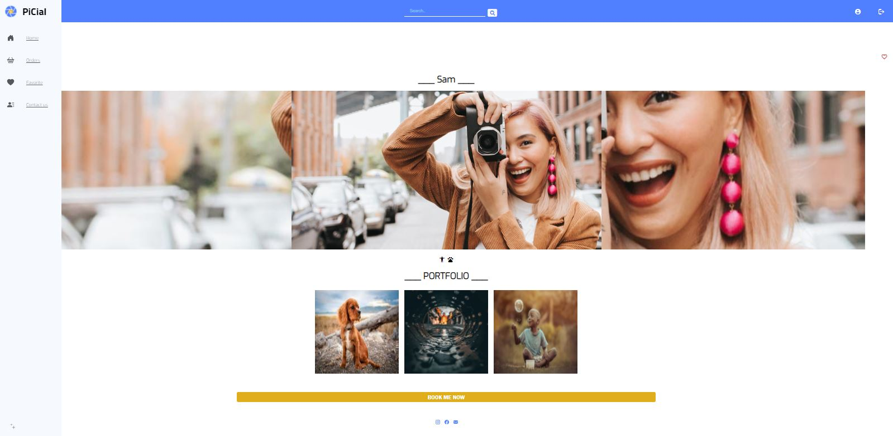
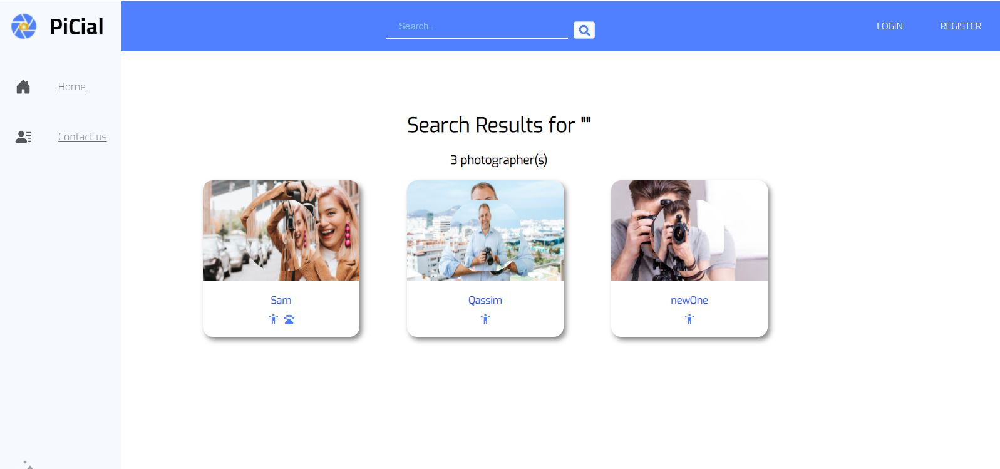
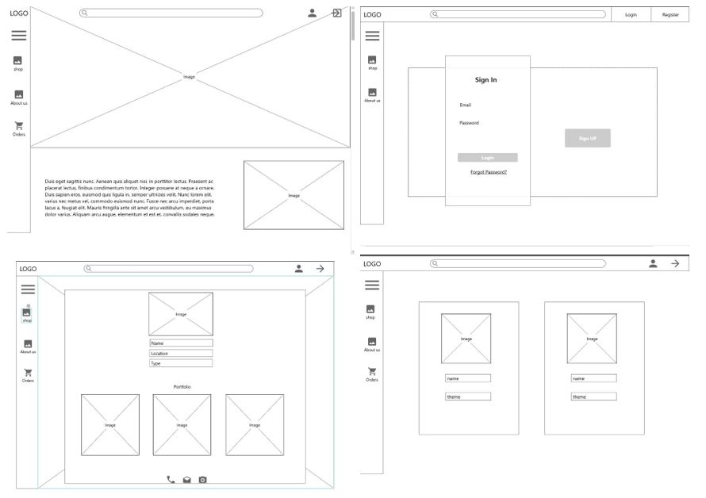
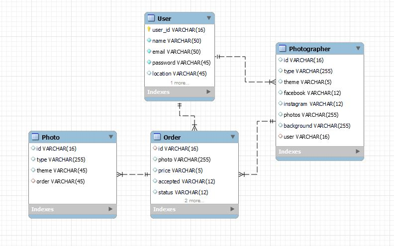

# [The PiCial]() 

 PiCial is platform that connects available photographers with their customers. It allows talented photographers to transfer their business to the web! 

# ScreenShots

# How to start ?
1. Enter The [PiCial]() website.
2. Naviagte the home page for: 
  

* Sign up as a service provider.

* Or sign up as a customer.

3. Book and manage tour booking.

# List of technologies used in this project:

* HTML
* CSS
* JavaScript
* React js
* Node js
* Express 
* [Mockplus WireFrame Tool](https://www.mockplus.com)
* MongoDB

# Wireframes:

# User Stories:
<li> As a user, I want to have control over my profile, do that i can customize it.
<li> As a user, I want to book a photographer, so that I can use their service of it.
<li> As a photographer, I want the to have control over my bookings, so that I cancel if needed.
<li> As a photographer, I want to have control over my profile, do that i can customize it.

# ERD:

# Main Features:
* Signup/Signin
* Edit profile
* Search a photographer
* Book a photographer
* Cancel Booking

# Future Work For The Maze
<li>Image based Recommender system

# Links
[BackEnd (Current)](https://git.generalassemb.ly/rahaf-alawwad/Picial_BackEnd) 
[BackEnd (Current)](https://git.generalassemb.ly/rahaf-alawwad/Picial_frontEnd) 